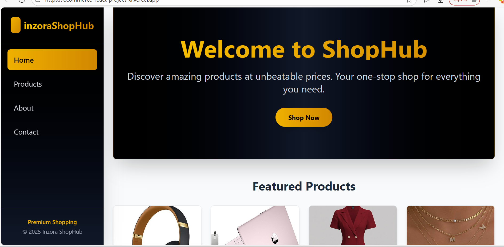

# InzoraShopHub - Static E-commerce Homepage

## Description
InzoraShopHub is a modern, responsive e-commerce website built with React and styled with Tailwind CSS. It features a clean, user-friendly interface with dynamic product displays, category filtering, and a responsive navigation system.

## Features
- Responsive navigation with mobile-friendly sidebar
- Product categorization (Electronics, Fashion, Accessories)
- Contact form with form validation
- Dynamic product cards with hover effects
- Gradient design elements 

## Pages
1. **Home** - Welcome page with featured products and hero section
2. **Products** - Categorized product listing with filterable views
3. **About** - Company information and story
4. **Contact** - Contact form and business information

## Technologies Used
- React 18
- Tailwind CSS
- React Router DOM
- Vite (Build tool)

## Screenshots


## Live Demo
[Visit InzoraShopHub](ecommerce-react-project-xi.vercel.app)

## Getting Started


### Installation

1. Clone the repository
```bash
git clone https://github.com/gihozo-elyse/ecommerce-react-project
cd inzorashophub
```

2. Install dependencies
```bash
npm install
```

3. Start the development server
```bash
npm run dev
```

4. Open http://localhost:5173 in your browser

### Project Structure
```
inzorashophub/
├── public/
│   ├── images/
│   └── ...
├── src/
│   ├── components/
│   │   ├── Navbar.jsx
│   │   ├── ProductCard.jsx
│   │   └── ...
│   ├── pages/
│   │   ├── Home.jsx
│   │   ├── Products.jsx
│   │   ├── About.jsx
│   │   └── Contact.jsx
│   ├── App.jsx
│   └── main.jsx
├── package.json
└── README.md
```

### Dependencies
```json
{
  "dependencies": {
    "react": "^18.2.0",
    "react-dom": "^18.2.0",
    "react-router-dom": "^6.x",
    "tailwindcss": "^3.x"
  },
  "devDependencies": {
    "@vitejs/plugin-react": "^4.x",
    "autoprefixer": "^10.x",
    "postcss": "^8.x",
    "vite": "^4.x"
  }
}
```


